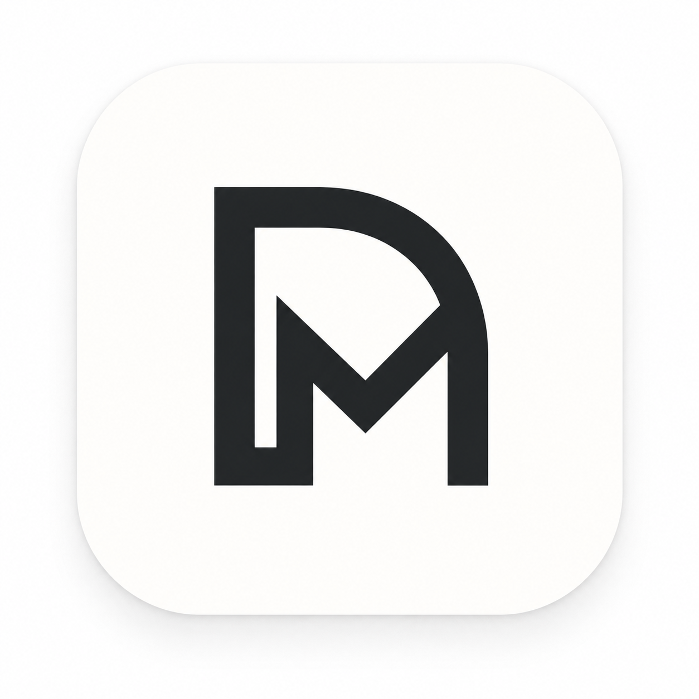

<p align="center">
  
</p>

# DeepMate

**A lightweight companion and control plane for AI harnesses.**  
**Starting with DeepSeek Harness.**

<p align="center">
  <a href="https://github.com/realchendahuang/DeepMate/releases"></a>
  <a href="LICENSE-MIT"></a>
  <a href="https://github.com/realchendahuang/DeepMate/actions/workflows/ci.yml"></a>
  <a href="https://github.com/realchendahuang/DeepMate/stargazers"></a>
  <a href="https://github.com/realchendahuang/DeepMate/releases"></a>
  <a href="https://github.com/realchendahuang/DeepMate/issues"></a>
  
</p>

DeepMate is a lightweight, cross-platform companion for managing an AI harness without replacing the harness itself.

It is designed to handle the things around the agent runtime — installation, lifecycle, models, providers, profiles, plugins, marketplaces, updates and diagnostics — while leaving the actual working interface to the harness.

For DeepSeek Harness, that means DeepMate can become the place where you manage the environment, then open the official Harness Web UI in your system browser when you are ready to work.

> DeepMate manages the harness. The harness does the work.

## Table of contents

- [Why DeepMate?](#why-deepmate)
- [What DeepMate is](#what-deepmate-is)
- [What DeepMate is not](#what-deepmate-is-not)
- [Architecture](#architecture)
- [Design principles](#design-principles)
- [Technology stack](#technology-stack)
- [Getting started](#getting-started)
- [Data layout](#data-layout)
- [Roadmap](#roadmap)
- [Project status](#project-status)
- [Related project](#related-project)
- [Star history](#star-history)
- [Contributing](#contributing)
- [License](#license)

## Why DeepMate?

DeepSeek Harness is extremely extensible: models, tools, agent presets, profile bundles and many runtime capabilities can all evolve independently.

That flexibility is powerful, but it also creates a growing management surface:

- Which runtime is installed and running?
- Which provider and model are active?
- Which profiles exist?
- Which plugins are installed, enabled, disabled or outdated?
- Which plugins are official, vetted by the maintainers, or community?
- Is the local environment healthy?
- How do I move the same setup to another machine?

DeepMate aims to make those questions easy to answer without turning into another heavyweight IDE or browser wrapper.

## What DeepMate is

DeepMate is a **control plane** for **DeepSeek Harness**: a pure data-layer control core plus a dedicated service crate that knows how to manage the harness. All harness-specific behavior lives in that one service crate, so adding support for another harness would never touch the core or the product surface.

### Core areas

- **Runtime** — install, detect, start, stop, restart, update and inspect the harness runtime
- **Providers** — configure DeepSeek, OpenAI, Anthropic and compatible/custom endpoints
- **Models** — browse and manage model capabilities and defaults
- **Profiles** — manage harness profiles, bundles and configuration layers
- **Plugins** — install, disable, enable, update, remove and inspect plugins
- **Marketplace** — discover plugins from curated and community sources, filtered by trust tier (official / vetted / community)
- **Doctor** — diagnose runtime, dependency, port, configuration and compatibility problems
- **Open Harness** — launch the official working interface in the system browser

## What DeepMate is not

DeepMate deliberately avoids becoming another AI IDE.

It does **not** aim to provide its own:

- chat interface
- terminal
- file explorer
- Git diff viewer
- browser workspace
- editor
- embedded Harness Web UI

There is no reason to duplicate the surface that the harness already owns.

The goal is to stay small, fast and focused.

## Architecture

DeepMate separates a harness-agnostic control core from a harness-specific service layer.

```text
               DeepMate

        ┌──────────────────┐
        │ Desktop UI + CLI │
        └────────┬─────────┘
                 │
        ┌────────▼─────────┐
        │   Control Core   │
        │ pure data layer  │
        └────────┬─────────┘
                 │
        ┌────────▼──────────┐
        │ deepseek-harness  │
        │   service crate   │
        └────────┬──────────┘
                 │
        ┌────────▼─────────┐
        │ DeepSeek Harness │
        └──────────────────┘
```

The UI does not need to know how DeepSeek Harness stores configuration or exposes its runtime. Those implementation details live in the `deepseek-harness` service crate; the control core holds only normalized domain models, the data layout, configuration, snapshots and update helpers.

This keeps the core simple and fully testable while the harness integration can move as fast as the harness itself does.

For the full technical design, see **[docs/ARCHITECTURE.md](docs/ARCHITECTURE.md)**.

## Design principles

### 1. Lightweight by default

Keep the resident control surface small, fast and focused. The actual Harness work interface opens in the system browser.

### 2. Respect the harness as the source of truth

DeepMate manages the harness through its official interfaces and formats whenever possible instead of maintaining a second copy of harness-owned configuration.

### 3. Extend, do not fork

DeepMate uses the existing DeepSeek Harness profile, bundle, plugin, settings and provider mechanisms rather than inventing incompatible replacements.

### 4. One harness, one service

Harness-specific behavior lives in the `deepseek-harness` crate. The control core stays a pure data layer and never learns harness-specific names.

### 5. Management surface, not work surface

DeepMate manages the environment around the agent. The actual conversation and execution experience remains owned by the harness.

### 6. Transparent local data

DeepMate-owned configuration and state use portable file formats that are easy to inspect, back up and move between machines.

## Technology stack

The current planned stack is:

- **Rust** — control core, the deepseek-harness service, runtime management and shared domain logic
- **Tauri 2** — cross-platform desktop shell (Rust backend + system WebView)
- **React + TypeScript** — desktop frontend
- **TailwindCSS v4 + shadcn/ui** — desktop styling and component library
- **Tokio** — asynchronous runtime and background work
- **reqwest + rustls** — network access
- **Serde** — serialization foundation
- **TOML** — human-owned DeepMate configuration
- **JSON** — structured state, cache and snapshots
- **JSONL** — append-oriented history and structured records
- **clap** — command-line interface
- **tracing** — structured logging and diagnostics
- **thiserror + anyhow** — domain and application error handling
- **OS secure credential store** — DeepMate-owned secrets

The desktop app and CLI are both consumers of the same Rust control core.

## Getting started

Requirements: a recent stable Rust toolchain, and Node.js 20+ (for the desktop
app's frontend).

```bash
# Build the core + CLI
cargo build --workspace

# Try the CLI
cargo run -p deepmate-cli -- status
cargo run -p deepmate-cli -- doctor

# Run the desktop shell (Tauri): installs frontend deps, then opens the app
cd apps/desktop
npm install
npm run tauri dev

# Rust workspace gate (formatting, clippy, tests)
make ci

# Everything a release must pass: Rust gate + frontend lint/typecheck/tests
make verify

# Prune the incremental build cache when target/debug grows too large
make cache-clean
```

Prebuilt binaries are published on
[GitHub Releases](https://github.com/realchendahuang/DeepMate/releases);
currently these are macOS (Apple Silicon) builds, produced locally. On other
platforms, build from source as described above.

On macOS the desktop app ships as a `DeepMate.app` bundle inside a DMG
(`deepmate-<version>-<target>.dmg`), with a `/Applications` shortcut for
drag-to-install. The DMG is ad-hoc signed, so the first launch after a
download needs a right-click "Open" (or `xattr -dr com.apple.quarantine`) to
clear Gatekeeper; it is not notarized. The CLI is also available as a plain
`tar.gz` on every platform.

Both the CLI and the desktop app accept
`--data-dir` to override the data directory. On Linux, building the desktop
app requires the Tauri system dependencies (`libwebkit2gtk-4.1-dev`,
`libgtk-3-dev`, `libayatana-appindicator3-dev`, `librsvg2-dev`).

CLI command surface:

```text
deepmate detect                Detect the harness
deepmate status                Show the active harness runtime status
deepmate open                  Open the harness UI in the system browser
deepmate doctor                Run environment diagnostics
deepmate runtime start|stop|restart
                                Control the harness runtime
deepmate profile list          List harness profiles
deepmate provider list         List configured providers
deepmate model list            List available models
deepmate plugin list [--check-updates]
                                List installed plugins (optionally marking
                                outdated ones from the market)
deepmate plugin install <spec> [--profile <name>] [--force]
                                Install a plugin into a profile; a definite
                                "incompatible" compatibility verdict refuses
                                the install unless --force is given
deepmate plugin check <spec>    Check a market package's compatibility with
                                the detected harness
deepmate plugin remove <id> [--profile <name>]
                                Remove a plugin from a profile
deepmate plugin disable <id> [--profile <name>]
                                Uninstall a plugin while remembering its spec,
                                so `enable` can restore the same version range
deepmate plugin enable <id> [--profile <name>]
                                Reinstall a previously disabled plugin
deepmate plugin update [id] [--profile <name>]
                                Update one plugin, or all plugins
deepmate market list           List known market sources
deepmate market search <query> Search the market for plugins
deepmate snapshot export <name>
                                Capture the current setup as a portable snapshot
deepmate snapshot import <name>
                                Apply a stored snapshot (merge-style)
deepmate snapshot list          List stored snapshots
deepmate config export <path>  Write DeepMate's own settings to a portable file
deepmate config import <path>  Replace DeepMate's own settings from a portable file
deepmate update                Update the CLI: download the release archive,
                               verify its sha256 and self-replace
```

DeepMate controls DeepSeek Harness only: every command talks to the `dsh`
CLI and the documented `$DSH_HOME` file contracts. There are no alternate
backends or capability switches to configure.

Append `--json` to any command for machine-readable output. Logs go to
stderr and to `logs/deepmate.log` in the data directory, so JSON on stdout
is never polluted.

## Data layout

DeepMate-owned data follows a simple file-based structure:

```text
<DeepMate Data>/
│
├── config.toml
├── cache/
│   ├── marketplace.json
│   ├── curated.json
│   └── plugin-metadata.json
├── history/
│   ├── actions.jsonl
│   └── doctor.jsonl
├── snapshots/
│   └── *.json
├── state/
│   └── harness.pid
└── logs/
    ├── deepmate.log
    └── harness-web.log
```

The root follows the operating system's application-data convention and can
be overridden with `DEEPMATE_DATA_DIR` or `--data-dir`.

Harness-owned state remains owned by DeepSeek Harness and is accessed through the deepseek-harness service.

## Roadmap

### Phase 1 — DeepSeek Harness foundation

- Runtime discovery and lifecycle management
- Open official Harness Web UI
- Environment diagnostics
- Provider and model management
- Profile discovery and management
- Initial CLI

### Phase 2 — Ecosystem management

- Plugin inventory
- Install / update / remove flows
- Marketplace sources
- Compatibility checks (implemented: `deepmate plugin check` matches a
  package's declared requirement against the detected harness, with an
  install preflight and `--force` override)
- Plugin diagnostics and trust signals (implemented: provenance metadata and
  normalized npm popularity/quality scores on market results)

### Phase 3 — Portable setups

- Environment snapshots (implemented in v0.6.0: `snapshot export / import /
  list` in the CLI and the desktop app)
- Export / import of DeepMate's own configuration (implemented: `config
  export / import` in the CLI and the desktop Settings page)
- Profile portability
- Private registries

## Project status

DeepMate is currently in **early development**, with a working Stage 1
foundation, a Stage 2 desktop shell, Stage 3 configuration editing,
Stage 4 plugin/marketplace support and Stage 5 snapshots:

- Rust workspace with `deepmate-core` (pure data layer), `deepmate-platform`
  and the `deepseek-harness` service crate
- `deepmate` CLI with `detect`, `status`, `open`, `doctor`, `runtime`,
  `profile`, `provider`, `model`, `plugin`, `market` and `snapshot`
  commands — `runtime start/stop/restart --scenario` manage any scenario,
  `runtime list` shows every scenario's state, `runtime task <scenario>
  "prompt"` runs one-shot tasks, and `provider`/`model` take `--scenario`
- File-based data layer: OS-convention data directory, TOML config, JSONL
  action history and file logging
- DeepSeek Harness service with real `dsh` integration: CLI detection, web
  UI reachability, `runtime start` (detached `dsh web` with pid tracking),
  `runtime stop`, profile discovery, plugin inventory, and provider/model
  catalogs through the documented `$DSH_HOME` file contracts
  (`profiles/*/package.json` and `settings.yaml`)
- Scenario-first architecture: scenarios are the top-level unit — switching
  scenarios switches the whole setup. Each scenario owns its surface (web
  console or one-shot tasks), its providers & models (a per-scenario
  settings document, isolated through the profile's `cordis.patch.yml`
  redirection of the engine `settings` row), its plugins, and its runtime
  (multiple web scenarios can run in parallel on distinct ports; task
  scenarios run one-shot prompts). The scenario home is the first entry
  point of the app; providers/models no longer live in a global page.
- Plugin lifecycle (install / remove / update) forwarded to the harness's own
  `dsh plugin` workflow, so profile and bundle reconciliation stay owned by
  the harness; DeepMate compensates where the harness leaves the manifest
  stale — an install of a real plugin also declares its bundle (so the web
  UI actually loads it), and a remove/disable strips the leftover bundle
  declaration
- Marketplace search backed by the npm registry, with a curated source driven
  by the DeepMate-maintained plugin list (`plugins/curated.json`, fetched
  from this repository and cached) vs community npm results, provenance
  metadata (publisher, repository, last-updated) and an on-disk query cache
- Portable snapshots: `snapshot export / import / list` capture a normalized
  inventory (profiles, providers, models, plugins — never secrets) to JSON
  and apply it merge-style to the harness, from both the CLI and the
  desktop Settings page
- Plugin compatibility checks and trust signals: market results carry
  provenance plus normalized npm popularity/quality scores; a compatibility
  check matches a package's declared `engines`
  requirement against the detected harness (prerelease harnesses count as
  their release line), `deepmate plugin check` inspects a package on demand,
  `plugin install` runs the check as a preflight (`--force` overrides), and
  the desktop Market tab installs search results behind the same preflight
- Own-settings backup: `config export / import` moves DeepMate's own
  configuration between machines as one JSON document, from the CLI or the
  desktop Settings page with native save/open dialogs
- `deepmate-desktop` Tauri shell (React + TypeScript + Tailwind + shadcn/ui)
  with a Discord-style tenant-first layout — a scenario rail (logo / scenes /
  global settings), a per-scenario sidebar (overview, run, providers, plugins)
  and system settings behind the rail gear — with responsive breakpoints and
  en/zh i18n
- Tauri command surface mirroring the CLI: inventory, configuration editing,
  plugin lifecycle, runtime control, snapshots, doctor, and config
  (language/theme/preferences) persistence, with action-history recording
- System tray with close-to-tray behavior (hide instead of quit, restore
  from the tray menu or a macOS dock click) and an opt-in start-at-login
  preference backed by OS login items; the tray also opens the harness web
  UI and runs an on-demand release check
- System notifications for a newer release — raised by the automatic startup
  check (opt-out preference) and by the tray's explicit check
- Update checking against the GitHub releases API (on by default, fails
  quiet when offline), surfaced as a banner on Overview and a check in
  Settings Preferences
- Self-update loop: `deepmate update` downloads the release archive,
  verifies its sha256 and replaces the running binary; the desktop app
  downloads and checksum-verifies the release DMG and hands it to the OS
  installer from the update banner
- Shared `deepmate-app` service crate hosting harness assembly, config,
  logging and history helpers used by both the CLI and the desktop app
- Releases are built and published locally (no CI publishing): the macOS
  host produces the `DeepMate.app` DMG plus a CLI tar.gz with sha256
  checksums, uploaded with `gh release create`
- Cross-platform CI (fmt, clippy, tests) with a core purity gate and a
  separate Tauri desktop build job

The first goal is to build a solid, minimal foundation for DeepSeek Harness
rather than rush into a large feature set.

## Related project

- [DeepSeek Harness](https://github.com/deepseek-ai/deepseek-harness)

## Star history

[](https://star-history.com/#realchendahuang/DeepMate&Date)

## Contributing

DeepMate is in early development and every contribution counts — bug reports,
feature ideas, documentation fixes and pull requests are all welcome.

- Found a bug or have an idea? [Open an issue](https://github.com/realchendahuang/DeepMate/issues/new)
- Want to change something? Open a pull request and run `make ci` before pushing
- Follow the project conventions in [AGENTS.md](AGENTS.md) and
  [docs/DESIGN_SYSTEM.md](docs/DESIGN_SYSTEM.md)

If DeepMate is useful to you, starring the repository helps it stay visible —
thank you! ⭐

## License

DeepMate is dual-licensed under the **MIT** and **Apache-2.0** licenses.

- MIT License — see [LICENSE-MIT](LICENSE-MIT)
- Apache License 2.0 — see [LICENSE-APACHE](LICENSE-APACHE)

Unless you explicitly state otherwise, any contribution intentionally
submitted for inclusion in the work shall be dual-licensed as above.
